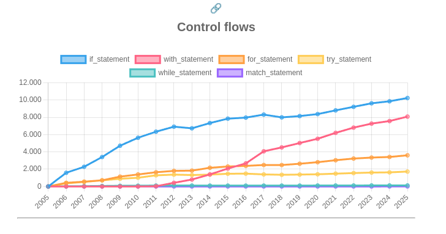

# Explorando evolução de código

Neste exercício, iremos explorar a evolução de código em sistemas reais.

Iremos utilizar a ferramenta [GitEvo](https://github.com/andrehora/gitevo).
Essa ferramenta analisa a evolução de código em repositórios Git nas seguintes linguagens: Python, JavaScript, TypeScript e Java.

Você deve submeter via Moodle apenas o link do seu `fork`, conforme descrito abaixo.

# Passo 1: Selecionar repositório a ser analisado

Selecione um repositório relevante na linguagem de sua preferência (Python, JavaScript, TypeScript ou Java).
Você pode encontrar projetos interessantes nos links abaixo:

- Python: https://github.com/topics/python?l=python
- JavaScript: https://github.com/topics/javascript?l=javascript
- TypeScript: https://github.com/topics/typescript?l=typescript
- Java: https://github.com/topics/java?l=java

# Passo 2: Instalar e rodar a ferramenta GitEvo

Instale a ferramenta [GitEvo](https://github.com/andrehora/gitevo) com o comando:

```
pip install gitevo
```

Rode a ferramenta no repositório selecionado através do seguinte comando (dependendo da linguagem do projeto que escolheu):

```shell
# Python
$ gitevo -r python <git_url>

# JavaScript
$ gitevo -r js <git_url>

# TypeScript
$ gitevo -r ts <git_url>

# Java
$ gitevo -r java <git_url>
```

Onde `<git_url>` é URL do repositório a ser analisado.
Por exemplo, para analisar o projeto Flask escrito em Python:

```
$ gitevo -r python https://github.com/pallets/flask
```

# Passo 3: Explorar os gráficos de evolução de código (`index.html`)

Ao rodar a ferramenta [GitEvo](https://github.com/andrehora/gitevo), o arquivo `index.html` é gerado com diversos gráficos de evolução de código.

Abra o arquivo `index.html` e observe com atenção os gráficos gerados.

# Passo 4: Explicar um gráfico de evolução de código

Selecione um dos gráficos de evolução e explique-o com suas palavras.
Por exemplo, você pode:

- Detalhar a evolução ao longo do tempo, 
- Detalhar se as curvas estão de acordo com boas práticas,
- Explicar grandes alterações nas curvas,
- Explorar a documentação do repositório em busca de explicações para grandes alterações
- Etc.

Seja criativo!

# Exercício

Para responder este exercício, primeiramente, você deve fazer um `fork` deste repositório.
No Moodle, você deve submeter apenas a URL do seu `fork`.

Em seguida, adicione o arquivo gerado `index.html` no seu fork.

Por fim, responda as questões abaixo no seu `fork`: 

1. Repositório selecionado: https://github.com/django/django

2. Gráfico selecionado: Control flows


  
3. Explicação:

Como Django é uma plataforma antiga, decidi aumentar a data de análise para o início desde sua criação, em 2005 usando o comando:

```
$ gitevo --from-year 2005 --to-year 2025 https://github.com/django/django
```

Analisando o gráfico "Control flows", podemos observar como o uso de diferentes estruturas de controle evoluiu no Django durante seus 20 anos de existência.

O que mais me chamou atenção foi o comportamento da linha rosa (with_statement), que era inexistente até 2010, mas depois teve um crescimento impressionante, tornando-se a segunda estrutura mais utilizada em 2025. Isso faz sentido porque o with só se tornou uma palavra-chave oficial do Python, e foi adotado no Django alguns anos depois.

Quando comecei a programar em Python, aprendi que o with é útil para gerenciar recursos como arquivos, conexões de banco de dados ou locks, garantindo que sejam fechados corretamente mesmo quando ocorrem erros. Por exemplo:

```shell
with open('arquivo.txt', 'r') as f:
    conteudo = f.read()
    # O arquivo será fechado automaticamente ao sair do bloco
```

Também é interessante notar que o if_statement (linha azul) sempre foi a estrutura de controle predominante. No entanto, sua taxa de crescimento diminuiu por volta de 2012-2013, mantendo-se relativamente estável até 2018, quando voltou a crescer.

Os loops for (linha laranja) tiveram um crescimento constante mas moderado, enquanto os loops while (linha verde-água) permaneceram em números muito baixos. Isso confirma o que em Python, geralmente preferimos usar for do que while quando possível.

Outro ponto notável é a estabilidade do uso de while_statement, mantendo-se em níveis baixos e constantes em todo o período, o que indica que o Django prefere outras estruturas de iteração, como for_statement, que apresenta números significativamente maiores.

A introdução mais recente do match_statement aparece apenas em 2024, com apenas duas instâncias, mostrando que o Django adota novas funcionalidades da linguagem de forma cautelosa e gradual.